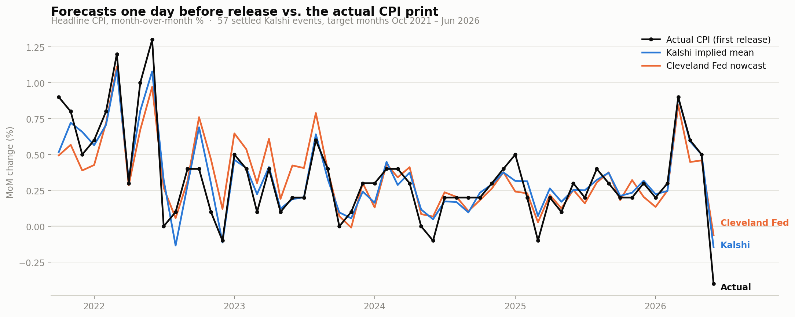
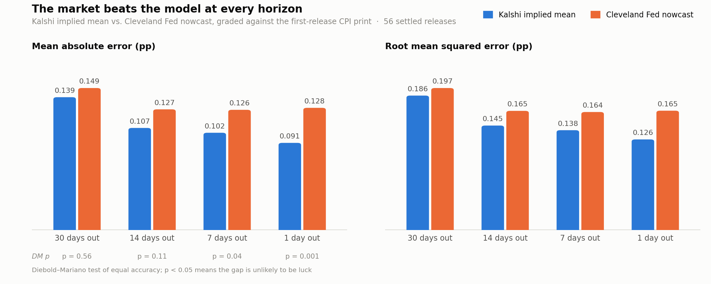

# Do Markets Know Inflation First?

**Evaluating Kalshi's CPI prediction markets as real-time forecasts of U.S. inflation**

[](https://github.com/YuangFu66/kalshi-cpi-prediction-markets/actions/workflows/reproduce.yml)


**Interactive version: [kalshi-cpi-forecasts.vercel.app](https://kalshi-cpi-forecasts.vercel.app)** — scrub through any month's market-implied distribution day by day, switch horizons and benchmarks, and read every value on hover.

Every month, real money trades on [Kalshi](https://kalshi.com) contracts of the form
*"Will CPI rise more than 0.3%?"*. This project turns five years of those prices
(monthly markets since June 2021) into a daily, market-implied probability
distribution over the upcoming CPI print, and asks whether the market forecasts
inflation as well as a professional model.

**It does, and better.** One day before release the market's implied mean missed the
print by **0.091 pp** on average, against **0.128 pp** for the Federal Reserve Bank of
Cleveland's daily nowcast. The gap is statistically significant (Diebold–Mariano
p = 0.001 over 56 releases), grows as the release approaches, and both forecasters
beat naive baselines by a wide margin.





*UCLA Master of Quantitative Economics, Quant Lab summer research project, June–August 2026.*
*Team: Yuang Fu, Agnibha Bhattacharya, Yingxuan Li. Mentors: Lora Yovcheva, Nathan Kunz.*

**Contents:** [Headline results](#headline-results) ·
[How prices become a forecast](#how-prices-become-a-forecast) · [Method](#method) ·
[Limitations](#limitations) · [Repository layout](#repository-layout) ·
[Reproduce everything](#reproduce-everything) · [Documents](#documents) ·
[Data sources](#data-sources)

## Headline results

Mean absolute error of each point forecast against the first-release CPI print, in
percentage points of month-over-month headline CPI. Every forecaster is read on the
same date, and the naive baselines use only prints already published by that date.

| Days before release | Releases | Kalshi implied mean | Cleveland Fed nowcast | Naive: last print | Naive: 12-month mean |
|---|---|---|---|---|---|
| 30 | 54 | **0.139** | 0.149 | 0.267 | 0.226 |
| 14 | 56 | **0.107** | 0.127 | 0.245 | 0.217 |
| 7  | 56 | **0.102** | 0.126 | 0.245 | 0.217 |
| 1  | 56 | **0.091** | 0.128 | 0.245 | 0.217 |

Could the gap be luck? The Diebold–Mariano test asks whether one forecaster's errors
are genuinely smaller month after month (Kalshi vs. Cleveland Fed, absolute-error loss):

| Days before release | Mean loss difference | DM t | p-value | Kalshi closer |
|---|---|---|---|---|
| 30 | −0.010 | −0.58 | 0.56 | 28 of 54 |
| 14 | −0.019 | −1.58 | 0.11 | 31 of 56 |
| 7  | −0.024 | −2.05 | 0.04 | 32 of 56 |
| 1  | −0.037 | −3.26 | 0.001 | 32 of 56 |

What the numbers say:

- **The market's edge grows as information arrives.** Its error falls by a third
  between 30 days out and the eve of release, while the nowcast plateaus near
  0.13 pp. The advantage is significant in the final week and only suggestive
  further out, where 56 events give the test limited power.
- **Both forecasters are essentially unbiased** (mean error within 0.02 pp). The
  market wins on tighter misses, not direction, and the result holds under RMSE,
  which weights the big-surprise months most.
- **Against naive baselines the market is far ahead at every horizon** (p < 0.001),
  and so is the nowcast.
- The market's implied mean and the actual print correlate at 0.92 one day before
  release.

All tables, including the robustness sample with all 57 events, squared-error loss and
Newey–West standard errors, are in [results/evaluation.md](results/evaluation.md).

## How prices become a forecast

Kalshi's monthly CPI event lists 5–15 binary **threshold contracts**, "Will CPI rise
more than *x*%?", spaced 0.1 pp apart. The yes-price of the *x* contract is the
market's probability that the print exceeds *x*, so differencing adjacent prices
slices the whole distribution into outcomes:

| Contract | Price = P(above) | Implied outcome | Probability |
|---|---|---|---|
| CPI > 0.0% | 95¢ | ≤ 0.0% | 5% |
| CPI > 0.1% | 78¢ | = 0.1% | 17% |
| CPI > 0.2% | 35¢ | = 0.2% | 43% |
| CPI > 0.3% | 8¢  | = 0.3% | 27% |
|            |     | > 0.3% | 8% |

The implied mean, Σ probability × outcome = **0.216%**, is the market's point
forecast; the implied standard deviation is its uncertainty, and the probability on
the bin that eventually occurred is its score. Because the bins are built by
differencing, they telescope to exactly 1 (verified on all 3,497 event-days), so the
only incoherence a threshold market can show is a higher threshold priced above a
lower one, which is measured and repaired rather than hidden.

## Method

1. **Data.** All 66 monthly events, 528 contracts and their daily candlesticks
   (bid/ask/trade OHLC, volume, open interest) from Kalshi's public API, no key
   required. The pull scripts route between the live and historical API tiers, which
   use different field names, and handle the 2024 series rename and two ticker
   conventions for negative thresholds. Raw responses are committed untouched in
   `data/raw/`.
2. **Cleaning rules, pre-registered in [DECISIONS.md](DECISIONS.md)** before any
   result was computed:
   - Price = end-of-day **bid/ask midpoint**, never the last trade: about half of
     quoted contract-days have zero trades, and stale prints can be days old.
   - Contract-days quoted 0/100 (spread > $0.90) carry no information and are
     excluded; spread and volume are carried in every row so analyses can filter by
     liquidity.
   - **Monotonicity.** P(CPI > 0.2%) can never exceed P(CPI > 0.1%), but
     independently traded contracts sometimes invert. A running minimum repairs the
     survival curve and the size of the fix is stored as `mono_violation`: nonzero on
     12% of event-days, typically a couple of cents, at most 41¢, and correlated
     (0.34) with spreads, a thin-market symptom reported as a finding.
   - **Ground truth** is Kalshi's settlement value, by construction the first-release
     BLS number, normalized from drifting string formats ("0.5", "0.60", ".9%") and,
     for the one event with no usable value, reconstructed from the contracts' own
     yes/no resolutions and checked against the BLS release.
3. **Construction** ([src/build_series.py](src/build_series.py)): for every
   event-day, difference the threshold prices into a distribution, reduce it to
   implied mean, implied SD and the probability of the true outcome, then freeze the
   distribution 30, 14, 7 and 1 days before each release.
4. **Benchmarks** ([src/build_benchmarks.py](src/build_benchmarks.py)): the Cleveland
   Fed's daily nowcast archive, matched to the latest value available on or before
   each snapshot date; two naive baselines built only from prints released by that
   date; and the current BLS vintage, used to show that 24 of the 61 prints have since
   been revised, which is why everything is graded against the first release.
5. **Evaluation** ([src/evaluate.py](src/evaluate.py)): MAE, RMSE and bias by
   horizon; Diebold–Mariano tests on absolute and squared error with plain and
   Newey–West variances; win counts.

The data-handling philosophy (raw data immutable, fixes are rules never hand-edits,
record don't discard, decide before looking, validate externally) is written up with
the real cases in [report/data_quality_methodology.md](report/data_quality_methodology.md).

## Limitations

- **Short sample.** 56 monthly releases, dominated by the 2021–23 inflation spike; a
  pre/post-2023 split is the natural next check.
- **Thin liquidity.** Many zero-volume days and wide spreads early in each market's
  life; liquidity covariates are carried in every row so results can be re-run on
  liquid days only.
- **Tails are an assumption.** The outermost bins are open-ended and valued one grid
  step beyond the last threshold; results involving the implied mean should be checked
  against alternative tail values.
- **Prices are not exactly probabilities.** Fees and spreads sit inside quoted prices.
- **October 2025** CPI was never published (federal shutdown). The event is kept in
  the data but excluded from the headline sample; including it changes no conclusion.
- The **economist consensus** benchmark is not included because no free archive
  exists; a hand-fill template is in the benchmark workbook.

## Repository layout

```
├── README.md
├── DECISIONS.md                 every methodology judgment call, recorded before evaluation
├── Makefile                     make = rebuild everything offline · make pull = re-download
├── requirements.txt
├── src/
│   ├── kalshi_api.py            Kalshi API helper: retries, pagination, live/historical fallback
│   ├── cpi_values.py            normalize / infer the settled CPI print
│   ├── pull_events.py           download events + contracts             -> data/raw/
│   ├── pull_candles.py          download daily candles (idempotent)     -> data/raw/candles/
│   ├── pull_cleveland_nowcast.py, pull_bls_cpi.py                        -> data/external/
│   ├── build_series.py          clean + construct the forecast series   -> data/clean/
│   ├── build_benchmarks.py      every forecaster per event and horizon  -> results/comparison.csv
│   ├── evaluate.py              accuracy tables + Diebold–Mariano tests -> results/
│   ├── make_comparison_chart.py, make_error_chart.py                      -> results/*.png
│   └── export_site_data.py      the tables behind the interactive site  -> site/data/
├── data/                        data dictionary for every file: data/README.md
│   ├── raw/                     Kalshi API responses, untouched (15 MB)
│   ├── external/                Cleveland Fed nowcast archive, BLS CPI index
│   └── clean/                   events_table, market_day, distribution_day, forecast_snapshots
├── results/                     comparison.csv, evaluation.md, accuracy + DM tables, charts, workbook
├── site/                        interactive results site (static HTML + Chart.js) -> kalshi-cpi-forecasts.vercel.app
├── report/                      proposal, methodology note, weekly updates, final presentation (PDF + PPTX)
├── tests/                       unit tests + checks that the committed data reproduces the reported numbers
└── .github/workflows/           CI: rebuilds every table from the raw data and fails on any difference
```

## Reproduce everything

```bash
git clone https://github.com/YuangFu66/kalshi-cpi-prediction-markets.git
cd kalshi-cpi-prediction-markets
pip install -r requirements.txt
make
make test
```

`make` rebuilds every clean table, results table, chart and site dataset from the
committed raw data in about fifteen seconds, with no network access; `make test`
runs the unit tests plus the integration checks against the numbers in this README.
Outputs land in `results/` (`evaluation.md` with every table, the CSV tables, the two
charts and the benchmark workbook), `data/clean/` and `site/data/`. To browse the
interactive site locally, serve the `site/` folder, for example with
`python3 -m http.server 8000 --directory site`, and open `http://localhost:8000`.

`make pull` re-downloads the raw data from Kalshi, the Cleveland Fed and the BLS
(about ten minutes, no API keys). Newer months will then be included, and the pinned
numbers in `tests/` will need updating together with this README.

Continuous integration runs `make` on every push and fails if any regenerated table
differs byte-for-byte from the committed one, so a green badge means the committed
results are exactly what the code produces from the committed data. Verified with
Python 3.9 / pandas 2.2 and Python 3.11 / pandas 3.

## Documents

| Document | What it is |
|---|---|
| [kalshi-cpi-forecasts.vercel.app](https://kalshi-cpi-forecasts.vercel.app) | Interactive results site (source in `site/`, data exported by `src/export_site_data.py`) |
| [report/CPI_final_presentation.pdf](report/CPI_final_presentation.pdf) | Final presentation, August 2026 ([PPTX](report/CPI_final_presentation.pptx)) |
| [report/proposal.md](report/proposal.md) | Week 1 proposal: question, market structure, construction plan, expected challenges |
| [report/data_quality_methodology.md](report/data_quality_methodology.md) | How every data problem became a rule, with the real cases |
| [DECISIONS.md](DECISIONS.md) | Pre-registered methodology decisions |
| [results/evaluation.md](results/evaluation.md) | Full results tables |
| [data/README.md](data/README.md) | Data dictionary |
| [week2_update.pptx](report/week2_update.pptx) · [week3_methodology.pptx](report/week3_methodology.pptx) · [benchmark_results_slide.pptx](report/benchmark_results_slide.pptx) | Weekly progress decks |

## Data sources

- **Kalshi** public trade API, series KXCPI (`https://api.elections.kalshi.com/trade-api/v2`):
  events, markets and daily candlesticks; pulled 2026-07-21.
- **Federal Reserve Bank of Cleveland**,
  [Inflation Nowcasting](https://www.clevelandfed.org/indicators-and-data/inflation-nowcasting):
  daily month-over-month CPI nowcast archive; pulled 2026-08-04.
- **U.S. Bureau of Labor Statistics**, [public API](https://www.bls.gov/developers/),
  series CUSR0000SA0 (CPI-U, all items, seasonally adjusted), current vintage; pulled 2026-08-04.

Code is released under the [MIT license](LICENSE). The data files are redistributed
for reproducibility and remain subject to their providers' terms.
